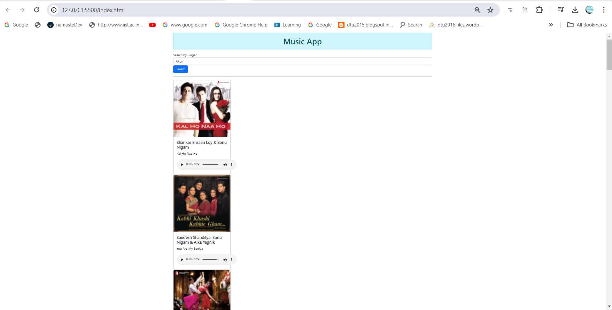

# MusicApp Using TypeScript

+ Music App is using iTunes API to populate songs by singerName.
+ api-client is using "fetch" to generate data from iTunesAPI.
+ song-operations is service which is filling data into the model "singer-model"
+ song-controller is invoking service "song-operations" and passing data to "index" html page 

## Image

